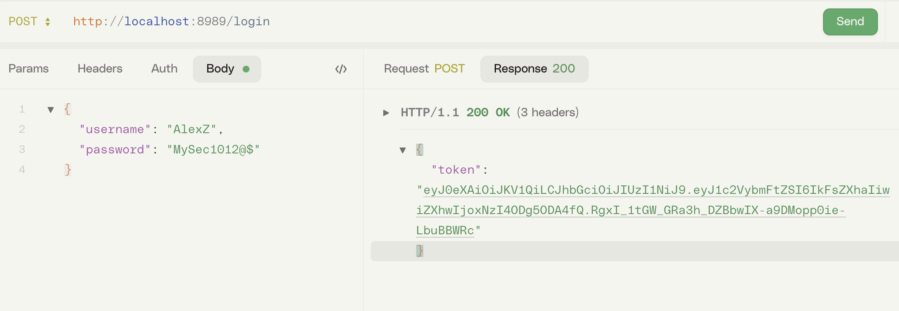
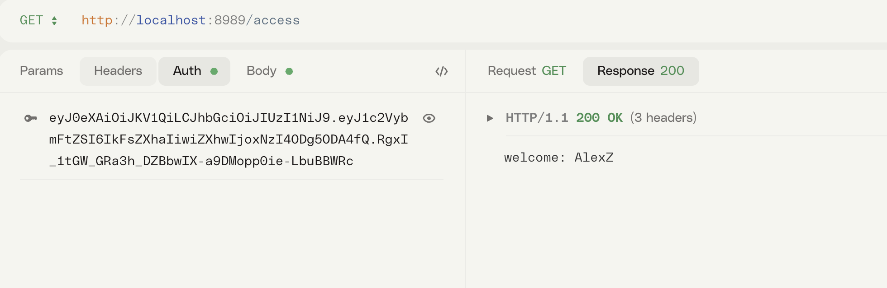

# How to use JWT in Axum

## Refer

[Implementing JWT Authentication in Rust](https://www.shuttle.dev/blog/2024/02/21/using-jwt-auth-rust#getting-started)

## login to generate JWT

## access the token

